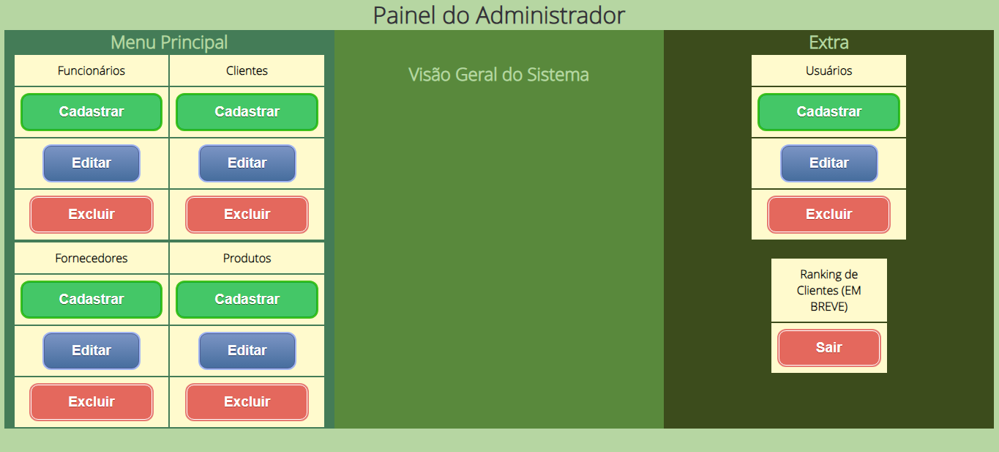
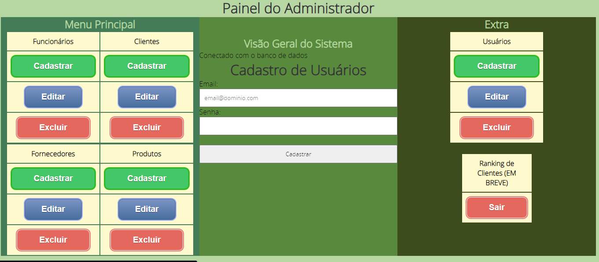
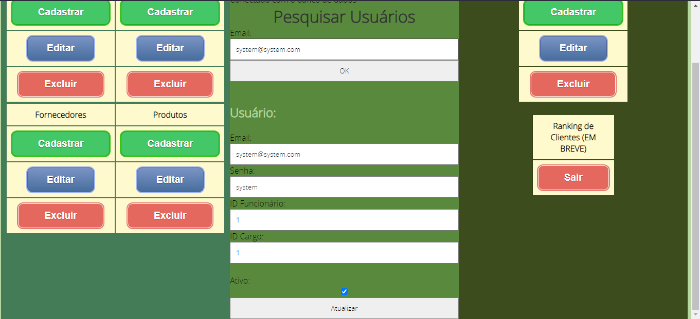
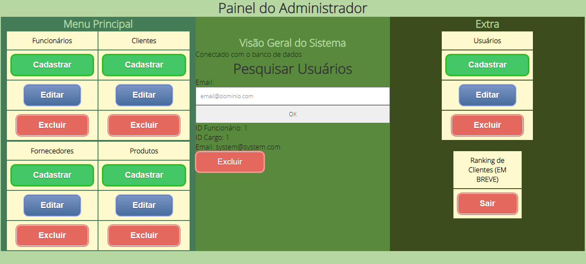

# Kaching Software

Kaching Software é um sistema de gerenciamento de inventário Full-Stack organizado em uma arquitetura MVC, programado em PHP, HTML e CSS. Ele permite realizar operações CRUD (criar, ler, atualizar e excluir) para produtos, funcionários, usuários e fornecedores.

## Capturas de Tela

### Tela Inicial

### Painel do Administrador

### Janela de Cadastro de Usuário

### Janela de Atualização de Usuário

### Janela de Remoção de Usuário

---
